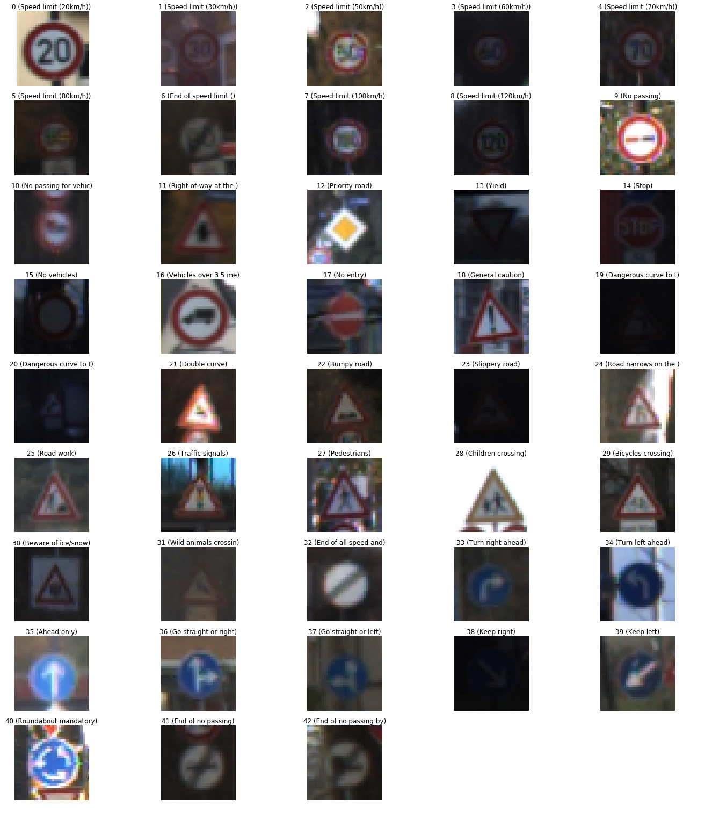
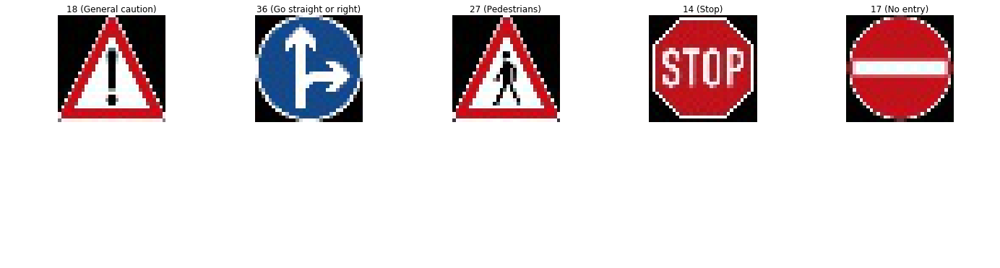
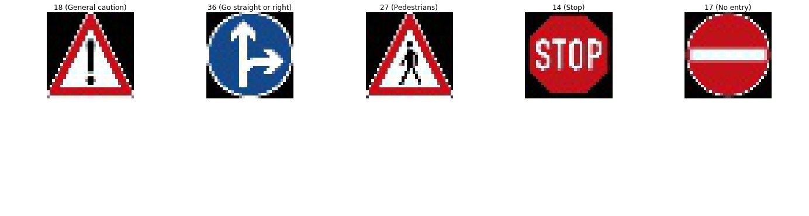
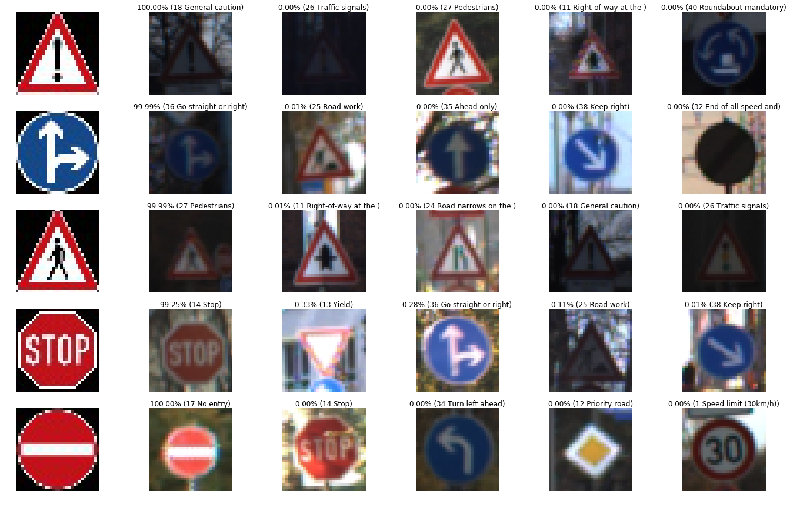
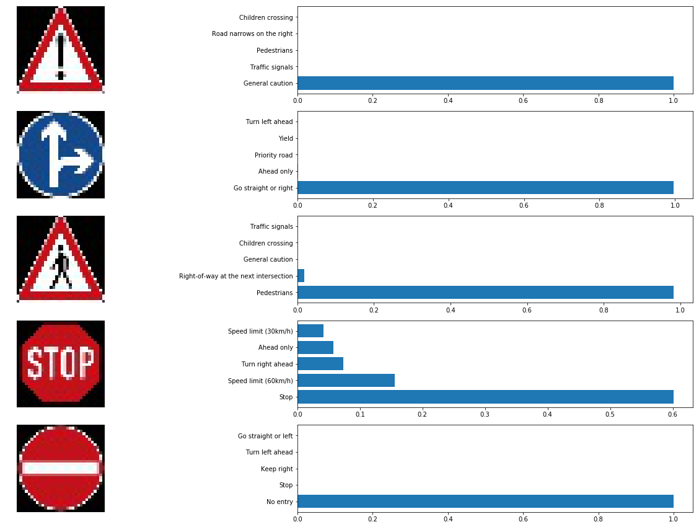
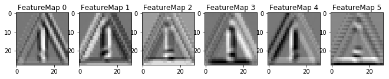

## Simple and Practical Traffic Sign Classifier (Recognition)
## Writeup

Overview
---
In this project, I will use the deep neural networks and convolutional neural networks to classify traffic signs. I will train and validate a model so it can classify traffic sign images using the [German Traffic Sign Dataset](http://benchmark.ini.rub.de/?section=gtsrb&subsection=dataset). After the model is trained, I will then try out my model on new test images of German traffic signs that I found on the web.

I have included 
* an Ipython notebook `Traffic_Sign_Classifier.ipynb` that contains the all the code you need to run this project. 
* a html file `Traffic_Sign_Classifier.html` which was exported from the Ipython notebook file.
* this README.md as a writeup report 

I would be grateful if you cite this work if you like it! 

The Project
---
The goals / steps of this project are the following:
* Load the data set
* Explore, summarize and visualize the data set
* Design, train and test a model architecture
* Use the model to make predictions on new images
* Analyze the softmax probabilities of the new images
* Summarize the results with a written report

In this project, I used and improved the parts of this GitHub repo: https://github.com/MarkBroerkens/CarND-Traffic-Sign-Classifier-Project. Compared to MarkBroerkens, my code uses differnet test data and provides the visualization results for the Neural Network's state `Optional Part`. Finally, please fell free and continue to develop this code more and more. 

### Dependencies
This work requires:

* [CarND Term1 Starter Kit](https://github.com/udacity/CarND-Term1-Starter-Kit)

The lab environment can be created with CarND Term1 Starter Kit. Click [here](https://github.com/udacity/CarND-Term1-Starter-Kit/blob/master/README.md) for the details.

### Dataset
1. Download the data set. Udacity provided a link to the data set [data set](https://s3-us-west-1.amazonaws.com/udacity-selfdrivingcar/traffic-signs-data.zip). This is a pickled dataset in which have been already resized the images to 32x32. It contains a training, validation and test set.

### Data Set Summary & Exploration

#### 1. Basic summary

I used the pandas library to calculate summary statistics of the traffic
signs data set:

* The size of training set is 34799
* The size of the validation set is 4410
* The size of test set is 12630
* The shape of a traffic sign image is (32, 32, 3)
* The number of unique classes/labels in the data set is 43

#### 2. Visualization

Here is an exploratory visualization of the data set. 

 

This bar chart showing how many classes we have in the data set and each class includes how many samples.

### Design and Test a Model Architecture

#### 1. Preprocessing

As a first step, I decided to convert the images to grayscale because the grayscaling reduces the sensitivity of detection to the color and reduces execution time. 

Here is an example of a traffic sign image before and after grayscaling.

Then, I normalized the image values from [0,255] to [-1,1] using the formula `(pixel - 128)/ 128`.

#### 2. Model Architecture

The model architecture is based on the LeNet model architecture. The dropout layers added before each fully connected layer in order to prevent overfitting. My final model consisted of the following layers:

| Layer                  |     Description                                |
|------------------------|------------------------------------------------|
| Input                  | 32x32x1 gray scale image                       |
| Convolution 5x5        | 1x1 stride, valid padding, outputs 28x28x6     |
| RELU                   |                                                |
| Max pooling            | 2x2 stride,  outputs 14x14x6                   |
| Convolution 5x5        | 1x1 stride, valid padding, outputs 10x10x16    |
| RELU                   |                                                |
| Max pooling            | 2x2 stride,  outputs 5x5x16                    |
| Flatten                | outputs 400                                    |
| **Dropout**            |                                                |
| Fully connected        | outputs 120                                    |
| RELU                   |                                                |
| **Dropout**            |                                                |
| Fully connected        | outputs 84                                     |
| RELU                   |                                                |
| **Dropout**            |                                                |
| Fully connected        | outputs 43                                     |
| Softmax                |                                                |

#### 3. Model Training
To train the model, I used an Adam optimizer and the following hyperparameters:
* batch size: 128
* number of epochs: 150
* learning rate: 0.0006
* Variables were initialized using the truncated normal distribution with mu = 0.0 and sigma = 0.1
* keep probalbility of the dropout layer: 0.5

My final model results were:
* training set accuracy of **0.996**
* validation set accuracy of **0.975** 
* test set accuracy of **0.954**

#### 4. Solution Approach
I used an iterative approach for the optimization of validation accuracy:
1. As an initial model architecture the original LeNet model from the course was chosen. In order to tailor the architecture for the traffic sign classifier usecase I adapted the input so that it accepts the color images from the training set with shape (32,32,3) and I modified the number of outputs so that it fits to the 43 unique labels in the training set. Accuracy on the validation set was lower than **0.93**. I tried to improve the accuracy by doing the followings: 

1. Add the grayscaling preprocessing (major improvement).

1. Doing additional normalization of the training and validation data (minor improvement).

1. Reduce the learning rate and increase the number of epochs (major improvement). Validation accuracy reached arround **0.94**. 

1. Overfitting. Add dropout layer after the relu of fully connected layer in layer 4 (minor improvement).

1. Still overfitting. Add dropout after the relu of fully connected layer in layer 3. Overfitting reduced but still not good.

1. Add dropout in layer 2 (minor improvement).

1. Doing further reduction of learning rate and increase of epochs. The validation accuracy got **0.975** 

To train the model I used these parameters: EPOCHS = 150, BATCH_SIZE = 128, rate = 0,0006, mu = 0, sigma = 0.1 .

### Test the Model on the New Images
#### 1. Acquiring New Images
Here are some German traffic signs that I found on the web: 

The "Stop" sign might be confused with the "No entry" sign because both signs have more ore less round shape and a pretty big red area.

#### 2. Performance on New Images
Here are the results of the prediction:

The model was able to correctly guess 5 of the 5 traffic signs, which gives an accuracy of 100%. This compares favorably to the accuracy on the test set of 95.4%

The code for making predictions on my final model is located in the `Predict the Sign Type for Each Image` cell of the `Traffic_Sign_Classifier.ipynb/html`

#### 3. Model Certainty - Softmax Probabilities
In the following images the top five softmax probabilities of the predictions on the captured images are outputted. 

The detailed probabilities and examples of the top five softmax predictions are given in the next image.

### Visualizing the Neural Network

It would be great to see what the network sees e.g. the visual output of your trained network's feature maps:

The neural network uses the many characteristics to make classifications like bourdays and edges posistions.

### How to improve this work

#### 1. Augmentation of Training Data
Augmenting the training set might help improve model performance. Common data augmentation techniques include rotation, translation, zoom, flips, inserting jitter, and/or color perturbation. I suggest [OpenCV](https://opencv.org) for most of the image processing activities.

#### 2. Further Experiments with TensorFlow
I suggest to investigate how alternative model architectures such as Inception, VGG, AlexNet, ResNet perfom on the given training set (transfer learning). 

Referencing The Project
---
If you like my code and you want to use it in your project, please refer it like this:

`Amani, Sajjad. "Simple and Practical Traffic Sign Classifier on the Road." GitHub, 25 September 2019, https://github.com/Sj-Amani/TrafficSign_Classifier`

