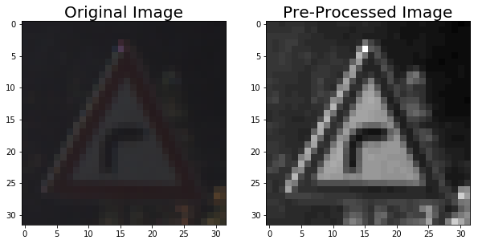
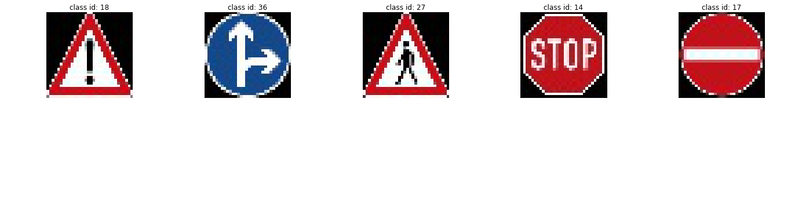
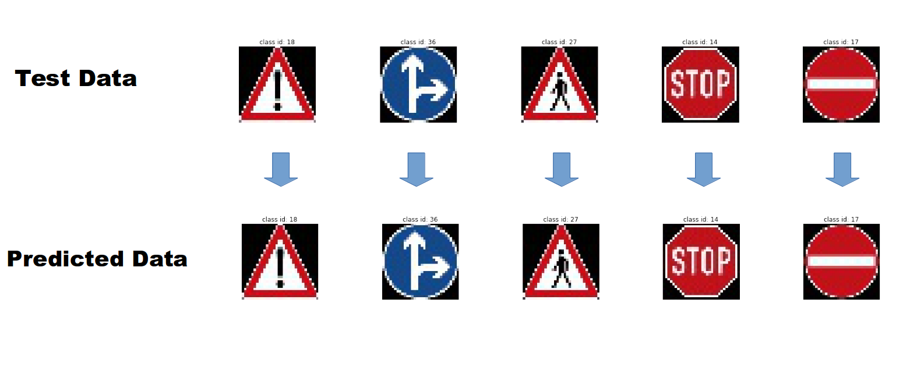
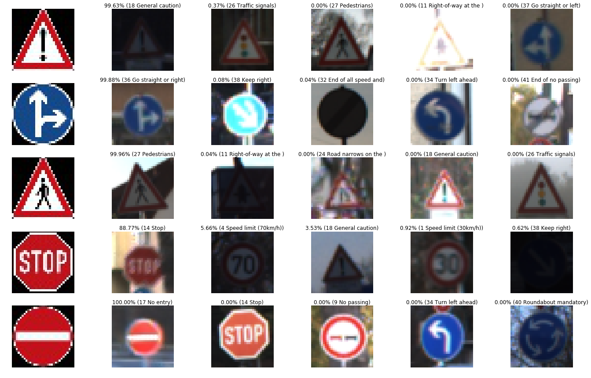
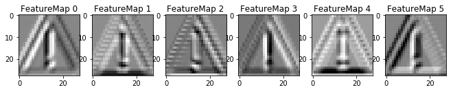
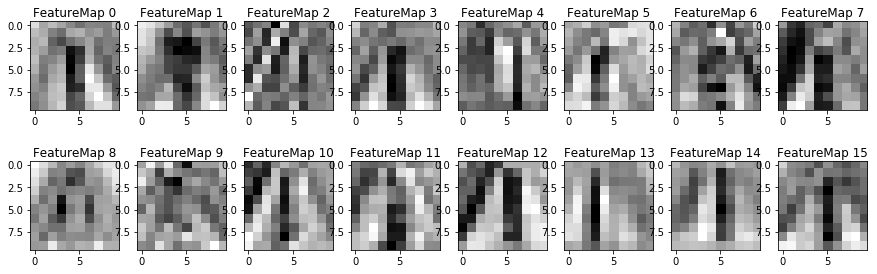

## Simple and Practical Traffic Sign Recognition

Overview
---
In this project, I will use the deep neural networks and convolutional neural networks to classify traffic signs. I will train and validate a model so it can classify traffic sign images using the [German Traffic Sign Dataset](http://benchmark.ini.rub.de/?section=gtsrb&subsection=dataset). After the model is trained, I will then try out my model on new test images of German traffic signs that I found on the web.

I have included 
* an Ipython notebook `Traffic_Sign_Classifier.ipynb` that contains the all the code you need to run this project. 
* a html file `Traffic_Sign_Classifier.html` which was exported from the Ipython notebook file.
* this README.md as a writeup report 

I would be grateful if you cite this work if you like it! 

The Project
---
The goals / steps of this project are the following:
* Load the data set
* Explore, summarize and visualize the data set
* Design, train and test a model architecture
* Use the model to make predictions on new images
* Analyze the softmax probabilities of the new images
* Summarize the results with a written report

In this project, I used and improved the parts of this GitHub repo: https://github.com/MarkBroerkens/CarND-Traffic-Sign-Classifier-Project. Compared to MarkBroerkens, my code uses differnet test data, parameter values and provides improved values for FASTER model training (I used 120 echos while MarkBroerkens used 150 and our final results are close to each other). Also, I have provided the visualization results for the Neural Network's state `Optional Part` which are NOT provided by MarkBroerkens. Finally, please fell free and continue to develop this code more and more. 

### Dependencies
This work requires:

* [CarND Term1 Starter Kit](https://github.com/udacity/CarND-Term1-Starter-Kit)

The lab environment can be created with CarND Term1 Starter Kit. Click [here](https://github.com/udacity/CarND-Term1-Starter-Kit/blob/master/README.md) for the details.

or 

* Python 3.5
* Tensorflow
* Numpy
* Pandas
* OpenCV-Python
* Matplotlib
* Pickle
* Glob
* csv
* Random
* Sklearn

### Dataset
Download the data set. Udacity provided a link to the data set [data set](https://s3-us-west-1.amazonaws.com/udacity-selfdrivingcar/traffic-signs-data.zip). This is a pickled dataset in which have been already resized the images to 32x32. It contains a training, validation and test set.

### How to run
Run the `Traffic_Sign_Classifier.ipynb`. This will train a model base on a data set and will show all results on a test set. Please fell free to use it for your own test.

### Data Set Summary & Exploration

#### 1. Basic summary

I used the pandas library to calculate summary statistics of the traffic
signs data set:

* The size of training set is 34799
* The size of the validation set is 4410
* The size of test set is 12630
* The shape of a traffic sign image is (32, 32, 3)
* The number of unique classes/labels in the data set is 43

#### 2. Visualization

Here is an exploratory visualization of the data set. In the image title, you can see how many samples are available in each class.

 

### Design and Test a Model Architecture

#### 1. Preprocessing

As a first step, I converted the images to grayscale and then normalized the image values from [0,255] to [-1,1]. The grayscaling reduces the sensitivity of detection to the color and reduces execution time. 

Here is an example of a traffic sign image before and after grayscaling.

#### 2. Model Architecture

The model architecture is based on the LeNet model architecture. The LeNet architecture accepts a 32x32xC image as input, where C is the number of color channels. Here, C is 1. The dropout layers added before each fully connected layer in order to prevent overfitting. My final model consisted of the following layers:

**Input.** The Input should be 32x32x1 gray scale image.

**Layer 1: Convolutional.** The output shape should be 28x28x6. (1x1 stride, valid padding)

**Activation.** RELU as activation function.

**Pooling.** The output shape should be 14x14x6.

**Layer 2: Convolutional.** The output shape should be 10x10x16. (1x1 stride, valid padding)

**Activation.** RELU as activation function.

**Pooling.** The output shape should be 5x5x16.

**Flatten.** Flatten the output shape of the final pooling layer such that it's 1D instead of 3D. The easiest way to do is by using `tf.contrib.layers.flatten`. This should have 400 outputs.

**Dropout** 

**Layer 3: Fully Connected.** This should have 120 outputs.

**Activation.** RELU as activation function.

**Dropout** 

**Layer 4: Fully Connected.** This should have 84 outputs.

**Activation.** RELU as activation function.

**Dropout** 

**Layer 5: Fully Connected (Logits).** This should have 43 outputs.

**Softmax** 

#### 3. Model Training
To train the model, I used an Adam optimizer and the following hyperparameters:
* batch size: 128
* number of epochs: 120
* learning rate: 0.0008
* Variables were initialized using the truncated normal distribution with mu = 0.0 and sigma = 0.1
* keep probalbility of the dropout layer: 0.5

My final model results were:
* training set accuracy of **0.995**
* validation set accuracy of **0.960** 
* test set accuracy of **0.941**

#### 4. Solution Approach
I used an iterative approach for the optimization of validation accuracy:
1. As an initial model architecture the original LeNet model from the course was chosen. In order to tailor the architecture for the traffic sign classifier usecase I adapted the input so that it accepts the color images from the training set with shape (32,32,3) and I modified the number of outputs so that it fits to the 43 unique labels in the training set. Accuracy on the validation set was lower than **0.93**. The accuracy improved by doing the followings: 

* Preprocessing the data set: RGB to Gray, Normalizing, Shuffling
* Change the hyperparameters: Reducing the training rate and changing the EPOCHS.
* Add the dropouts in the layers 2, 3, and 4.

To train the final model I used these parameters: EPOCHS = 120, BATCH_SIZE = 128, rate = 0,0004, mu = 0, sigma = 0.1 .

### Test the Model on the New Images
#### 1. Acquiring New Images
Here are some German traffic signs that I found on the web:

The "Stop" sign might be confused with the "No entry" sign because both signs have more ore less round shape and a pretty big red area.

#### 2. Evaluation of Model on New Images
Here are the results of the predictions vs the new test images. The model can predict all the new test images correctly.

#### 3. Model Certainty - Softmax Probabilities
The top five softmax probabilities of the predictions with their values on the are shown as follow: 

### Visualizing the Neural Network

This Section is for understaning the output of a neural network's weights. While neural networks can be a great learning device they are often referred to as a black box. We can understand what the weights of a neural network look like better by plotting their feature maps. After successfully training your neural network you can see what it's feature maps look like by plotting the output of the network's weight layers in response to a test stimuli image. From these plotted feature maps, it's possible to see what characteristics of an image the network finds interesting. For a sign, maybe the inner network feature maps react with high activation to the sign's boundary outline or to the contrast in the sign's painted symbol.

I have Provided for you below the visualization output of two tensorflow weight convlutional layers. The inputs to the function is an image from the new test data which is shown before.

As you can see in the above images, the neural network uses different characteristics to make classifications like boundaries, edges posistions, and the contrast in the sign's painted symbol. 

Referencing The Project
---
If you like my code and you want to use it in your project, please refer it like this:

`Amani, Sajjad. "Simple and Practical Traffic Sign Recognition on the Road." GitHub, 13 October 2019, https://github.com/Sj-Amani/TrafficSign_Classifier`

